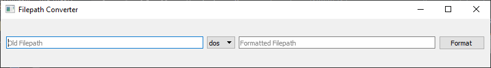
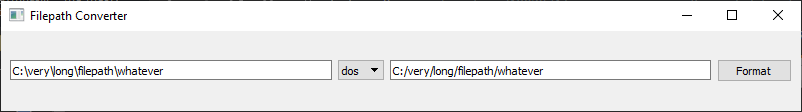
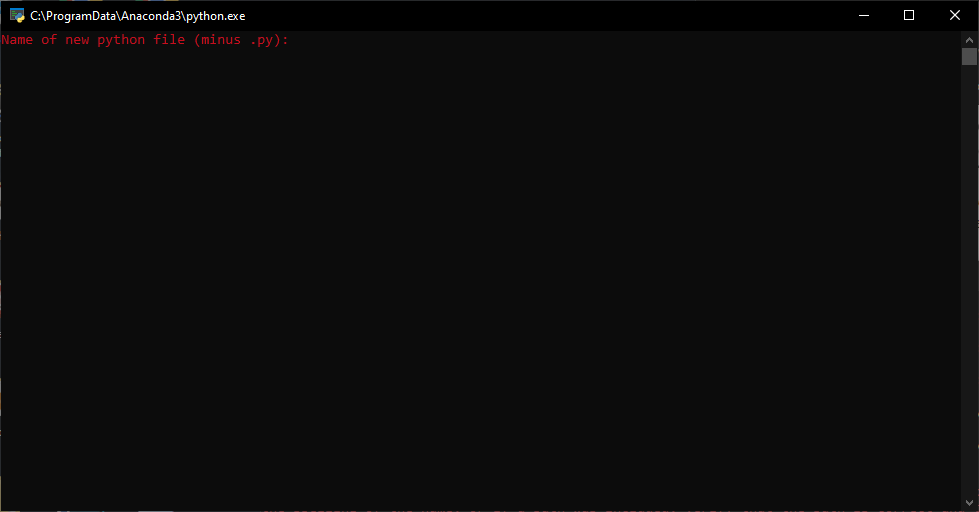

# USEFULS

*Usefuls* is a collection of small command line and GUI programs designed to make a programmer's life easier. If you're a programmer, inspect the files, and you'll know how to download/install/run the various programs. NOTE: PyQt5 is required to run GUI versions of the *Usefuls* programs.

The format of the individual programs (command line/GUI) and supported OS's will be noted in their descriptions.

## filepath_converter

#### Program Format(s):
* GUI
* Command Line

#### Supported OS(s):
* Linux (in progress)
* MacOS (in progress)
* Windows 10

*filepath_converter* converts filepaths from one OS format to another, based on the option *dos* or *nix*. Run in terminal/cmd with *-c* to run in command line mode, which notably does not require PyQt5 to run, as the program attempts to import PyQt5 only if the program is not running in command line mode.

GUI Application:




Mac/Linux/\*nix Terminal:
```bash
put the bash terminal version here
```

Windows CMD/Powershell:
```powershell
PS C:\> python filepath_converter.pyw -c
dos or nix: dos
File path: C:\very\long\filepath\whatever
Formatted filepath:     "C:/very/long/filepath/whatever"
```

## newpy

#### Program Format(s):
* Command Line

#### Supported OS(s):
* Linux (in progress)
* MacOS (in progress)
* Windows 10

*newpy* is a simple script that creates a new *.py* file in the current directory with the `#!/usr/bin/env python` shebang. Simply copy to a project directory and double-click.

"Double-Click"


Mac/Linux/\*nix Terminal:
```bash
put the bash terminal version here
```

Windows CMD:
```powershell
PS C:\> python newpy.py
Name of new python file (minus .py): myfile
```
